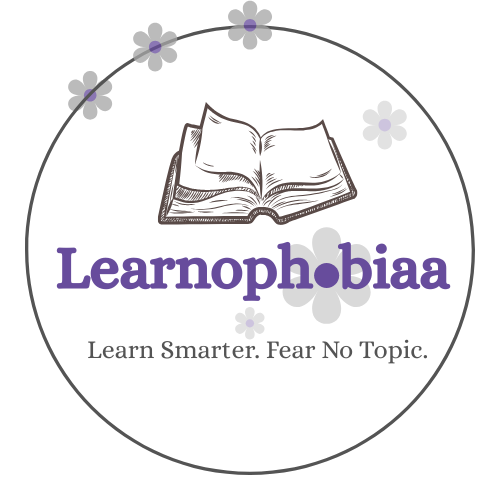

<div align="center">

<!-- Learnophobiaa Logo -->


# Learnophobiaa 📚

### *A community platform where students learn, build, and grow — together.*

<br/>


</div>

---

## 🌟 What is Learnophobiaa?

**Learnophobiaa** is a student-built, student-driven learning platform designed to make education engaging, accessible, and community-powered. Whether you're a beginner trying to crack your first concept or a seasoned learner exploring advanced topics — Learnophobiaa is your space to **learn without fear**.

> "The name says it all — we cure the fear of learning, one concept at a time."

---

## ✨ Features

- 📖 **Structured Learning Paths** — Curated courses and tracks for different domains
- 🧠 **Peer-to-Peer Knowledge Sharing** — Students teaching students
- 🛠️ **Project Showcase** — Build real projects and share them with the community
- 💬 **Community Discussions** — Ask doubts, share resources, collaborate
- 🏆 **Achievement System** — Track your progress and celebrate milestones
- 🌐 **Open & Inclusive** — Free to use, free to contribute

---

## 🚀 Getting Started

### Prerequisites

Make sure you have the following installed:

- [Node.js](https://nodejs.org/) (v18 or above)
- [npm](https://www.npmjs.com/) or [yarn](https://yarnpkg.com/)
- [Git](https://git-scm.com/)

### Installation

```bash
# Clone the repository
git clone https://github.com/your-username/learnophobiaa.git

# Navigate into the project directory
cd learnophobiaa

# Install dependencies
npm install

# Start the development server
npm run dev
```

Open your browser and visit `http://localhost:3000` 🎉

---

## 📁 Project Structure

```
learnophobiaa/
├── public/             # Static assets
├── src/
│   ├── components/     # Reusable UI components
│   ├── pages/          # Route-based pages
│   ├── styles/         # Global and component styles
│   ├── utils/          # Helper functions
│   └── data/           # Static data / mock content
├── .env.example        # Environment variable template
├── package.json
└── README.md
```

---

## 🤝 Contributing

Learnophobiaa thrives because of its community. We welcome contributions of all kinds!

1. **Fork** this repository
2. **Create** your feature branch: `git checkout -b feature/your-feature-name`
3. **Commit** your changes: `git commit -m "feat: add your feature"`
4. **Push** to your branch: `git push origin feature/your-feature-name`
5. **Open** a Pull Request 🎯

<!-- Please read our [CONTRIBUTING.md](./CONTRIBUTING.md) for detailed guidelines. -->

---

## 🛡️ Code of Conduct

This is a safe and inclusive space for all learners. We expect all contributors and community members to follow our [Code of Conduct](./CODE_OF_CONDUCT.md). Be kind, be helpful, and lift each other up.

---

## 📬 Contact & Community

Have a question, idea, or feedback?

- 🐛 **Bug Reports / Feature Requests** → [Open an Issue](https://github.com/your-username/learnophobiaa/issues)
<!-- - 💡 **General Discussion** → Join our community forum / Discord *(link coming soon)* -->
- 📧 **Email** → learnophobiaa@gmail.com

---

## 📄 License

This project is licensed under the **MIT License** — see the [LICENSE](./LICENSE) file for details.

---

<div align="center">

Made with ❤️ by students, for students.

**Learnophobiaa** — *Fear nothing. Learn everything.*

</div>
